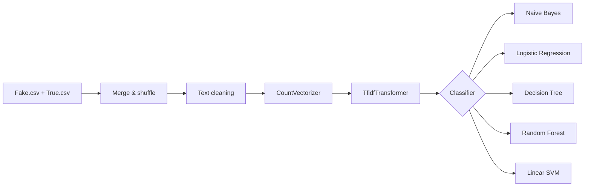
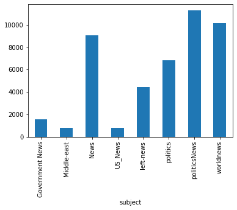
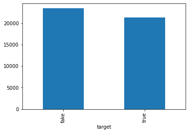
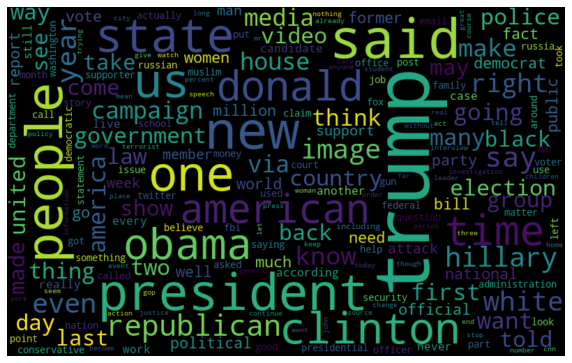
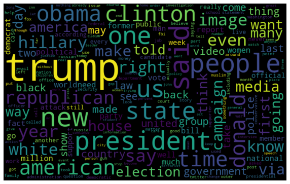
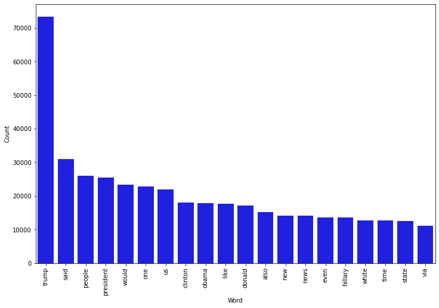
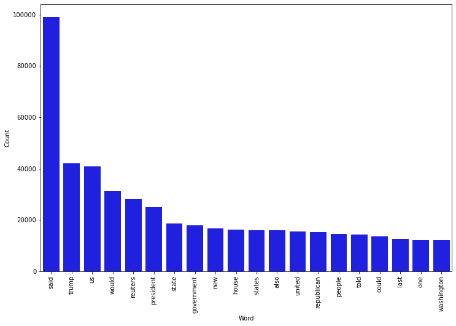
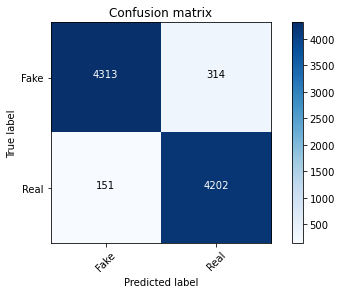
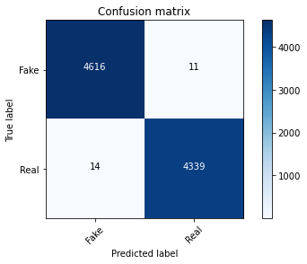

# 📰 Fake News Detection with Machine Learning

<table>
<tr>
<td>

**Binary NLP classification** — distinguish fake vs. real news articles using classical scikit-learn pipelines.

| | |
|---|---|
| **Task** | Text classification |
| **Dataset** | [Fake & Real News (Kaggle)](https://www.kaggle.com/datasets/clmentbisaillon/fake-and-real-news-dataset) |
| **Models** | Naive Bayes · Logistic Regression · Decision Tree · Random Forest · Linear SVM |
| **Stack** | Python · pandas · scikit-learn · NLTK · Jupyter |

</td>
<td align="right">


</td>
</tr>
</table>

> Bachelor-era learning project — exploratory NLP, EDA, word clouds, confusion matrices, and side-by-side model comparison.

---

## Pipeline



Each classifier shares the same feature pipeline: bag-of-words counts → TF-IDF weighting → model fit on article **text** only (title and date removed).

---

## Project Structure

```
├── data/                  # Fake.csv & True.csv (download — see data/README.md)
├── docs/
│   ├── RESULTS.md         # Recorded model accuracies
│   └── images/            # Sample EDA & evaluation plots
├── notebooks/
│   └── fake_news_detection.ipynb
├── outputs/               # Generated results (gitignored)
├── scripts/
│   └── train.py           # CLI training & evaluation
├── src/
│   └── fake_news_detection/
│       ├── data.py
│       ├── models.py
│       └── preprocessing.py
├── tests/
├── LICENSE
├── pyproject.toml
├── requirements.txt
└── README.md
```

---

## Setup

```bash
git clone https://github.com/noorcs39/Machine-Learning-ML-Fake-News-Detection.git
cd Machine-Learning-ML-Fake-News-Detection
python -m venv venv
venv\Scripts\activate        # Windows
# source venv/bin/activate   # macOS / Linux
pip install -r requirements.txt
pip install -e .
```

Download `Fake.csv` and `True.csv` from [Kaggle](https://www.kaggle.com/datasets/clmentbisaillon/fake-and-real-news-dataset) into the `data/` folder.

---

## Usage

**Jupyter notebook** (full EDA, word clouds, confusion matrices):

```bash
jupyter notebook notebooks/fake_news_detection.ipynb
```

**Command-line training** (requires dataset in `data/`):

```bash
python scripts/train.py --data-dir data
```

**Run tests:**

```bash
pytest tests/ -v
```

---

## Results

| Model | Accuracy |
| --- | ---: |
| Naive Bayes | 94.82% |
| Logistic Regression | 99.04% |
| Decision Tree | 99.72% |
| Random Forest | — |
| Linear SVM | — |

See [docs/RESULTS.md](docs/RESULTS.md) for details. Re-run the notebook or `scripts/train.py` after adding the dataset to reproduce metrics.

---

## Sample Outputs

<p align="center">
  
  
  
</p>
<p align="center">
  
  
  
</p>
<p align="center">
  
  
  
</p>

---

## Author

**Noor Uddin**  
📧 [noor.cs2@yahoo.com](mailto:noor.cs2@yahoo.com)  
🔗 [linkedin.com/in/noonari](https://www.linkedin.com/in/noonari/)  
🐙 [github.com/noorcs39](https://github.com/noorcs39)

---

## License

This project is licensed under the [MIT License](LICENSE).
